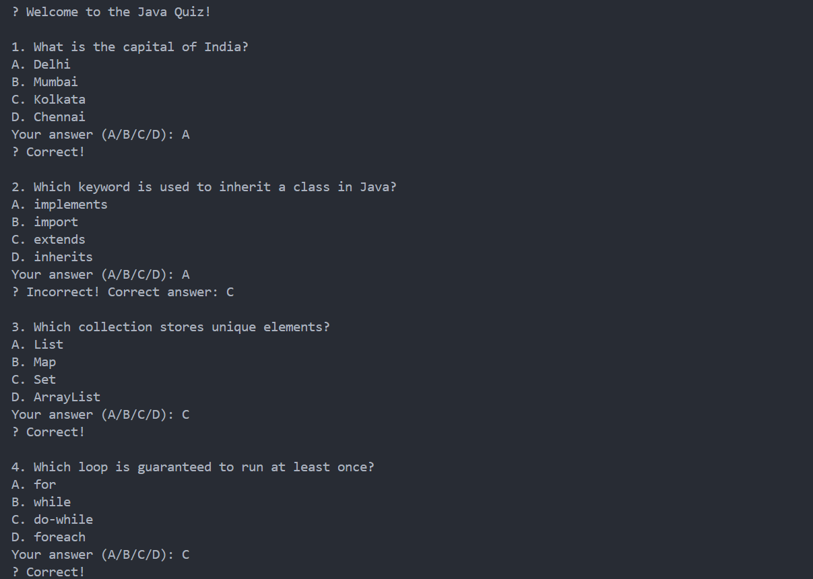

# 🎯 Java Console Quiz App

**Task 8 – Elevate Labs Java Developer Internship**  
A simple console-based Java quiz application to test user knowledge through multiple-choice questions. This project emphasizes Java collections, loops, control flow, and user input handling.

---

## 🚀 Features

- ✅ Multiple-choice questions with 4 options each  
- 🎯 User input captured via `Scanner`  
- 🧠 Score calculation and result display  
- 🔁 Reusable and extendable structure  
- 🔐 Input validation (accepts only valid choices)

---

## 🛠 Technologies Used

- ☕ Java (Core Java)
- 🎛️ Console-based interface
- 🧰 Data Structures: `ArrayList`, `Map`
- 🔄 Loops & Conditionals
- 📥 `Scanner` class for user input

---

## 📁 Project Structure

```

QuizApp/
│
├── Main.java               // Main class to run the app
├── Question.java           // Model class for quiz questions
├── Quiz.java               // Logic to load questions and evaluate answers
├── Interview_Questions.txt // Interview Q\&A file
├── Screenshot.png          // (Optional) UI screenshot
└── README.md               // Project documentation

```

---

## 📷 Sample Output (Console)




---

## 🎯 Learning Outcome

✅ Apply real-world use of:

* Java control flow (if-else, switch, loops)
* Collection framework (`List`, `Map`)
* Object-oriented design (`POJO`, `Encapsulation`)
* Input validation using `Scanner`

